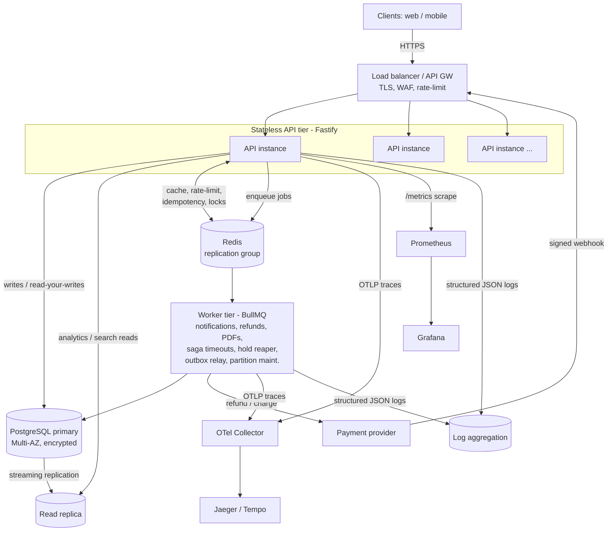
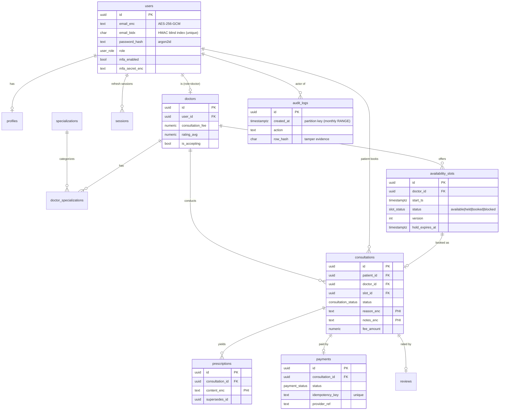

# Architecture

Amrutam Telemedicine Backend — design for scalability, reliability, security and
observability. Targets: **100k daily consultations**, **p95 < 200ms reads /
< 500ms writes**, **99.95% availability**.

## 1. High-level architecture & data flow

A stateless, horizontally-scalable API tier fronts PostgreSQL (primary + read
replica) and Redis, with heavy/deferrable work pushed to a BullMQ worker tier.
Statelessness (JWT auth, no server-side session store on the hot path) is what
lets the API scale out behind a load balancer to hit the throughput/availability
targets.



**Request data flow (read):** LB → API → (cache hit? return) → replica read →
populate cache → response. **Write:** LB → API → auth/RBAC → validation →
idempotency claim → DB transaction (+ outbox) → cache invalidation → response;
side effects (notifications, refunds) happen asynchronously via the queue.

## 2. Booking flow (sequence)

Booking is the critical, contended write path. It is an **orchestration saga**
with compensation, protected by idempotency and row-level locking.

```mermaid
sequenceDiagram
  autonumber
  participant C as Patient
  participant API as API (BookingService)
  participant DB as PostgreSQL
  participant PSP as Payment gateway
  participant Q as Job queue

  C->>API: POST /bookings {slotId} + Idempotency-Key
  API->>DB: claim idempotency key (INSERT ON CONFLICT)
  alt key already completed
    API-->>C: replay stored response (Idempotent-Replayed)
  end

  Note over API,DB: Step 1 — RESERVE (txn)
  API->>DB: BEGIN; SELECT slot FOR UPDATE
  alt slot not available
    API-->>C: 409 SLOT_UNAVAILABLE
  else available
    API->>DB: slot=held; INSERT consultation(pending_payment);\nINSERT saga; INSERT outbox(booking.created); COMMIT
  end
  API->>Q: enqueue booking.timeout (delayed) — crash safety net

  Note over API,PSP: Step 2 — CHARGE (idempotent on consultation id)
  API->>PSP: charge(amount, idemKey)
  alt declined
    API->>DB: compensate: consultation=cancelled, slot=available, payment=failed, saga=compensated
    API-->>C: 402 PAYMENT_FAILED
  else succeeded
    Note over API,DB: Step 3 — CONFIRM (txn)
    API->>DB: payment=succeeded; slot=booked; consultation=scheduled;\nsaga=completed; outbox(consultation.scheduled); COMMIT
    API->>Q: enqueue notification(booking_confirmed)
    API-->>C: 201 Consultation(scheduled)
  end
```

If the process dies between steps, the delayed `booking.timeout` job and the
`slots.reap_holds` reaper both restore consistency (cancel the dangling
consultation, free the slot).

## 3. ER diagram



Key integrity constraints: unique `(doctor_id, start_ts)` and a GiST exclusion
constraint prevent overlapping slots; a **partial unique index** on
`consultations(slot_id) WHERE status IN active` guarantees one active
consultation per slot; `payments` has a partial unique index per consultation
plus a unique `idempotency_key`.

## 4. API schema
REST with OpenAPI 3 generated from the code's TypeBox route schemas (single
source of truth — no drift). Served at `/docs`; committed at `openapi.json`.
Conventions: cursor (keyset) pagination, RFC-7807-style error envelope
(`{error:{code,message,details,requestId}}`), `Idempotency-Key` on writes,
bearer JWT auth, per-route RBAC.

## 5. Retry & backoff strategies
- **DB transactions** retry on serialization/deadlock (SQLSTATE `40001`/`40P01`)
  with exponential backoff ([`db.tx`](../src/db/pool.ts)).
- **Async jobs** (BullMQ) retry with exponential backoff (5 attempts, 1s base) +
  dead-lettering via `removeOnFail` retention.
- **Payment gateway** calls are idempotent (keyed on consultation id) so retries
  never double-charge; webhooks are de-duplicated by provider event id.
- **Clients** get `429` with `Retry-After` on rate limits and `409
  RETRYABLE_CONFLICT` for transient lock contention.
- **Redis/DB pools** bound connections and time out fast rather than pile up.

## 6. Data partitioning
- **`audit_logs`** is **declaratively RANGE-partitioned by month** — the highest
  volume, append-only table. Benefits: O(1) retention (detach/drop old months),
  smaller per-partition indexes for fast writes, and partition pruning on
  time-filtered queries. A `DEFAULT` partition prevents insert failures; the
  `audit.partition.maintain` job pre-creates upcoming months.
- **`consultations`** (~36M rows/yr) is indexed for its access paths today; the
  documented scale-out is monthly RANGE partitioning on `scheduled_start`
  (PK `(id, scheduled_start)`), automatable with `pg_partman`. A BRIN index on
  `created_at` already keeps time-range scans cheap.
- **Horizontal scale beyond one primary**: shard by `doctor_id` (co-locates a
  doctor's slots/consultations) or adopt Citus; read replicas absorb
  analytics/search in the interim.

## 7. Caching & concurrency handling
- **Caching (cache-aside, Redis):** doctor profiles (5 min TTL), search results
  (30s, keyed by a hash of the filter set), admin analytics (60s). Writes
  invalidate the specific profile and the search namespace. Cache hit/miss is a
  Prometheus metric.
- **Concurrency:** double-booking is prevented by `SELECT … FOR UPDATE` on the
  slot row + the partial unique index backstop; the hold reaper uses `FOR UPDATE
  SKIP LOCKED` to avoid worker contention; slots carry a `version` column for
  optimistic paths; a Redis CAS lock (`withLock`) serialises singleton jobs.

## 8. Transaction management & sagas
- **Local ACID transactions** wrap each atomic step (reserve, confirm,
  compensate) via `db.tx` with the appropriate isolation and retry.
- **Booking saga** coordinates the multi-step, cross-resource workflow (slot +
  consultation + payment) with explicit **compensating transactions** on
  failure; state is persisted in `saga_instances` so a crash can be recovered.
- **Transactional outbox** (`outbox` table written in the same txn as the state
  change; relayed at-least-once by the worker) solves the dual-write problem —
  no "committed but never published" events. Consumers are idempotent.

## 9. Backup & DR strategy
- **RDS**: Multi-AZ synchronous standby (survives an AZ failure), automated
  backups with 14-day **point-in-time recovery**, snapshot copy to a second
  region for regional DR. Read replica for load isolation and fast promotion.
- **Redis**: replication group with automatic failover + daily snapshots. Redis
  holds only regenerable/ephemeral data (cache, rate-limit, idempotency cache,
  queues) — the durable idempotency + saga state lives in Postgres, so a Redis
  loss is non-catastrophic.
- **Targets**: RPO ≈ 5 min (PITR), RTO ≈ 15–30 min (Multi-AZ failover / restore).
- **Runbook**: infra reproducible via Terraform; migrations are versioned and
  forward-only; secrets in Secrets Manager. DR drills restore a snapshot into a
  standby stack quarterly.

## Non-functional summary

| Concern | Mechanism |
|---------|-----------|
| p95 latency SLOs | cache-aside reads, keyset pagination, bounded pools, async offload, tuned indexes |
| 99.95% availability | stateless API + autoscaling, Multi-AZ data stores, circuit-breaker deploys, rate-limit fail-open |
| Throughput (100k/day) | horizontal scale, read replica, Redis, partitioned audit log |
| Correctness under load | row locks + unique indexes, idempotency, sagas + outbox |
